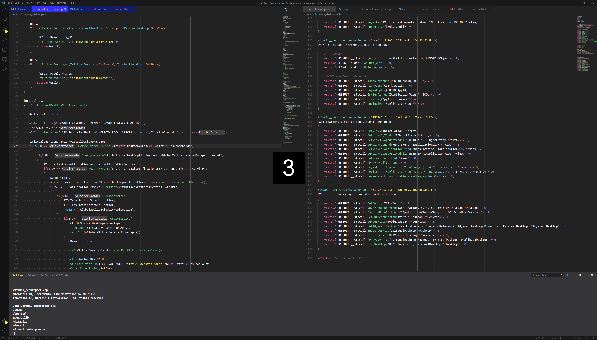

# Virtual Desktopper

Virtual Desktopper identifies the current virtual desktop briefly upon switching. It is similar to the "Identify" feature when dealing with more than one physical display. It was designed with instantaneous switching in mind (disable "Show animation in Windows").

